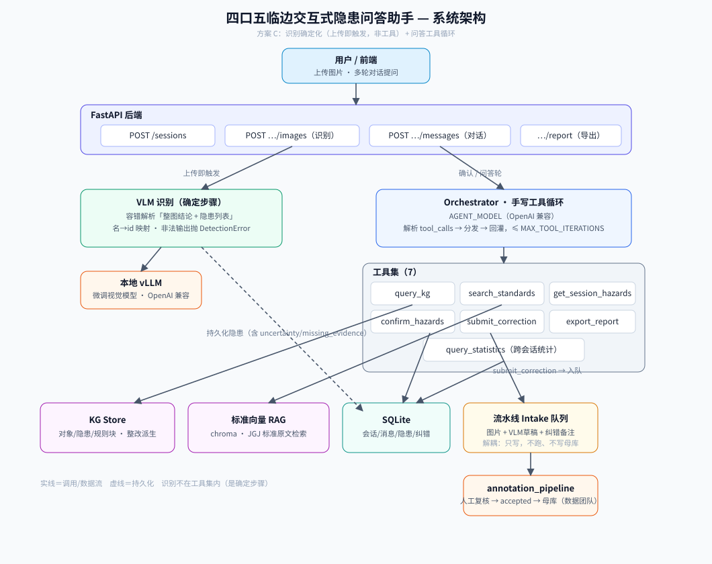
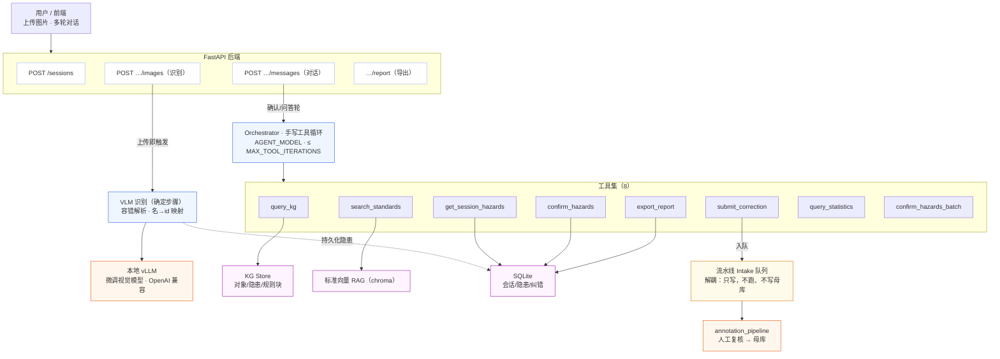

# 四口五临边交互式隐患问答助手

围绕一个**微调 VLM(视觉语言模型)** 构建的建筑安全隐患识别与问答 Agent。用户上传工地照片,系统自动识别「四口五临边」类安全隐患,主动与用户确认结果,基于知识图谱与国家标准给出带证据、可溯源的多轮问答与整改建议;当识别有误时,把纠错样本回流到标注流水线,形成**数据飞轮**。

> 「四口」= 楼梯口、电梯井口、预留洞口、通道口;「五临边」= 阳台、屋面、楼层、基坑、跑道/斜道临边。

---

## 目录

- [1. 它解决什么问题](#1-它解决什么问题)
- [2. 系统架构](#2-系统架构)
- [3. 核心数据流](#3-核心数据流)
- [4. 模块说明](#4-模块说明)
- [5. 知识资产](#5-知识资产)
- [6. 工具集（Agent 能力）](#6-工具集agent-能力)
- [7. 数据飞轮：人在回路纠错](#7-数据飞轮人在回路纠错)
- [8. 上下文管理](#8-上下文管理)
- [9. RAG 检索层](#9-rag-检索层)
- [10. API 接口](#10-api-接口)
- [11. 配置](#11-配置)
- [12. 安装与运行](#12-安装与运行)
- [13. 测试](#13-测试)
- [14. 关键设计决策](#14-关键设计决策)
- [15. 目录结构](#15-目录结构)
- [16. 不在本轮范围](#16-不在本轮范围)

---

## 1. 它解决什么问题

工地安全巡检中，识别「四口五临边」防护隐患依赖经验且容易遗漏。本项目把一个**微调好的 VLM**（专门看工地图片、输出结构化隐患判断）包装成一个可对话的 Agent：

- **看得懂**：VLM 输出整图结论 + 隐患列表（对象、隐患类型、bbox、推理链、视觉证据、状态）。
- **说得清**：Agent 对照知识图谱（KG）和 JGJ 国家标准原文，回答「依据是什么」「该怎么整改」，并给出条文出处。
- **会纠错**：识别后主动问「对不对」，用户说不对就追问、记录，并把样本送回标注流水线，让模型越用越准。

VLM 单次输出示例（一个隐患对象）：

```json
{
  "scene": "四口五临边",
  "related_object": "基坑临边防护",
  "object_bbox": [0, 278, 999, 999],
  "hazard_type_id": "missing_protection",
  "hazard_type": "防护缺失",
  "status": "confirmed_hazard",
  "evidence_sufficiency": "sufficient",
  "visual_evidence": "图中可见基坑开挖形成较深临边，坑边及作业面周边未见连续防护设施。",
  "rule_basis": "开挖深度2m及以上……未设置防护栏杆……人员可直接接近坠落边缘。",
  "reasoning_chain": [
    {"step": "observe",     "content": "……"},
    {"step": "locate",      "content": "……"},
    {"step": "match_rule",  "content": "……"},
    {"step": "assess",      "content": "……"}
  ]
}
```

---

## 2. 系统架构

采用**方案：识别确定化 + 问答工具循环**。



<details>
<summary>Mermaid 源码（可编辑，GitHub 直接渲染成图）</summary>



</details>

<details>
<summary>ASCII 版（终端友好）</summary>

```
                     ┌──────────────────────────────────────────────┐
   上传（单张）─────► │  POST /sessions/{id}/images                    │
                     │  1) 校验+落盘 → 2) VLM 识别(确定步骤,非工具)  │
                     │  3) 持久化隐患 → 4) 主动确认问句               │
                     ├──────────────────────────────────────────────┤
   批量上传 ────────► │  POST /sessions/{id}/images/batch              │
                     │  1) 逐文件校验 → 2) 线程池并发 VLM             │
                     │  3) 批量持久化 → 4) 聚合摘要 + 批量上下文      │
                     └───────────────┬──────────────────────────────┘
                                     │
   多轮对话 ───────► ┌───────────────▼──────────────────────────────┐
   POST .../messages │  Orchestrator：手写工具循环(AGENT_MODEL)      │
                     │  ┌────────────────────────────────────────┐   │
                     │  │ confirm_hazards  confirm_hazards_batch  │   │
                     │  │ submit_correction  query_kg             │   │
                     │  │ search_standards  get_session_hazards   │   │
                     │  │ export_report  query_statistics         │   │
                     │  └────────────────────────────────────────┘   │
                     └───┬──────────┬───────────┬──────────┬─────────┘
                         │          │           │          │
                    ┌────▼───┐ ┌────▼─────┐ ┌───▼────┐ ┌───▼────────┐
                    │  KG    │ │ 标准向量 │ │ SQLite │ │ 流水线      │
                    │ Store  │ │ RAG(chroma)│ 持久化 │ │ intake 队列 │
                    └────────┘ └──────────┘ └────────┘ └────────────┘
```

</details>

**两条核心原则：**

1. **识别是确定步骤**，不交给 LLM 临场决定是否调用 —— 上传即触发 VLM，结果作为稳定结构化资产入库，bbox/状态/推理链可被后续多轮稳定引用。
2. **问答是工具循环** —— AGENT_MODEL 持一组小工具，在 `MAX_TOOL_ITERATIONS` 内自主决定调哪个工具、何时作答。

**技术栈：** Python 3.11+ · FastAPI · openai SDK（统一调本地 vLLM 与 AGENT_MODEL，均 OpenAI 兼容）· chromadb · SQLite · pydantic-settings · pytest。**不引入 LangChain/LangGraph**，工具循环手写，控制流可控、可测、易调。

---

## 3. 核心数据流

### A. 单张上传识别轮 `POST /sessions/{id}/images`
1. 校验图片类型与大小（`MAX_IMAGE_BYTES`），按内容 sha1 命名落盘到 `UPLOAD_DIR`（带路径越界防护）。
2. 调本地 vLLM 识别 → 解析为 `DetectionResult{scene, hazards[]}`。
3. 持久化图片与隐患（状态 `awaiting_confirmation`），完整保留 `uncertainty_reason`/`missing_evidence` 等字段。
4. 返回隐患列表 + 一句主动确认：「以上识别结果是否正确？」

### A2. 批量上传识别轮 `POST /sessions/{id}/images/batch`
1. 逐文件校验类型与大小；无效文件记入 `failed_files` 并跳过，全部无效则返回 `422`。
2. 有效文件落盘后，`ThreadPoolExecutor`（`MAX_VLM_WORKERS` 个工作线程）**并发**调 VLM；单张失败仅追加 `failed_files`，不中断其余。
3. 所有线程完成后统一写 DB：每张成功图 `add_image` + `add_hazards`，再写一条聚合 assistant 摘要消息和一条 `[context] 批量上传 image_ids=...` 系统上下文。全部失败时只写一条失败提示 assistant 消息，不写 system 上下文。
4. 返回 `{batch_id(UUID,仅供日志关联), total, succeeded, failed, summary{confirmed_hazard,uncertain,safe}, failed_files, assistant_message}`。

### B. 确认轮（用户在对话中回复）
- **「正确」** → Agent 调 `confirm_hazards(image_id)`，该图隐患置 `confirmed`（只有 confirmed 隐患才进入导出报告）。
- **「不正确」** → Agent 追问「具体哪里不正确？」。
- **用户描述错误** → Agent 调 `submit_correction(image_id, note)`：纠错落库 + 经 `intake.deposit` **沉入流水线待处理队列**，该图置 `corrected_submitted`，回复「已记录并入队」。

### C. 问答轮（标准溯源 / 整改）
- Agent 用 `query_kg` / `search_standards` / `get_session_hazards` 取证后作答，引用 KG 与标准原文；整改建议由 KG 的 `qualified_conditions`（合格条件）或 `rule_blocks`（规则块兜底）派生。

---

## 4. 模块说明

| 模块 | 职责 | 关键契约 |
|---|---|---|
| `app/config.py` | 读 `.env`（pydantic-settings） | VLM endpoint 未设时回退共享 OpenAI 配置 |
| `app/vlm/detector.py` | 调本地 vLLM、容错解析输出 | 输出 `DetectionResult`；名→id 映射；非法 JSON 抛 `DetectionError` |
| `app/kg/store.py` | 载入知识图谱 + 规则块 | `get_object` / `get_hazard_type` / `remediation_for` / `rule_blocks_for` |
| `app/retrieval/standards.py` | 标准 OCR 向量库（RAG） | `build(roots)` 建索引；`search(query, top_k)` 返回片段+出处 |
| `app/correction/intake.py` | 纠错样本写入流水线队列 | `deposit(image, result, note)`；只写文件、不跑流水线、不写母库 |
| `app/reports/builder.py` | 生成 Word（.docx）报告 | 由会话内 `confirmed` 隐患生成；标题/段落/整改条目结构化排版 |
| `app/persistence/db.py` | SQLite 持久化 | 线程锁保护；会话/消息/图片/隐患/纠错读写 |
| `app/agent/tools.py` | 8 个工具的 schema、分发与调用守卫 | 跨会话 `image_id` 鉴权（`_owns_image`）；`ToolGuard` 负责工具名校验、必填参数校验、同轮去重 |
| `app/agent/prompts.py` | 系统提示词 + 识别展示模板 | 指导确认/纠错/作答流程 |
| `app/agent/orchestrator.py` | 一轮调度 + 手写工具循环 | 识别确定化；`system` 上下文统一前置；循环上限兜底；单张/批量已处理图的识别摘要自动压缩；每轮实例化 `ToolGuard` 拦截非法/重复调用 |
| `app/api/*` | FastAPI 路由与依赖装配 | sessions / images / messages / reports |

---

## 5. 知识资产

位于 `知识图谱主文件/`（只读资产）：

- **`four_openings_edges_kg_v2.json`** —— 四口五临边视觉隐患识别知识图谱：
  - 9 类防护对象（每个含 `definition`、`inspection_scope`、`qualified_conditions` 合格条件、标准 `source`）；
  - 6 类隐患类型（防护缺失、防护不连续、临时替代、固定不牢、防护门缺失、通行异常）；
  - 3 种状态（明确隐患 / 未见明显隐患 / 证据不足）。
- **`four_openings_edges_rule_blocks.json`** —— 65 条规则块，按对象 + 隐患类型组织，含规则原文、视觉线索、标准溯源。用于补充 `qualified_conditions` 为空的对象（如基坑、阳台临边）的整改依据。
- **`标准规范文件/`** —— JGJ 59-2011 / JGJ 80-2016 标准 PDF、MinerU OCR 结果（`*.md`）、结构化评分表。RAG 检索层从这里建向量索引。

VLM 的输出字段与 KG 实体**完全对齐**（`related_object`→object_id、`hazard_type_id`、`status` 等），这是整个系统能溯源的基础。

---

## 6. 工具集（Agent 能力）

仅问答循环使用；**识别不在工具集内**（是确定步骤）。

| 工具 | 作用 |
|---|---|
| `query_kg(object_id?, hazard_type_id?)` | 查 KG 实体：定义、检查范围、`qualified_conditions`（整改依据）、`rule_blocks`（规则块兜底，最多 5 条，超出部分由 `rule_blocks_total` 标注）、隐患类型、标准出处 |
| `search_standards(query, top_k)` | 向量检索 JGJ 标准原文片段，返回条文 + 文件/章节出处 |
| `get_session_hazards(image_id?, status_filter?, limit?)` | 召回本会话已识别隐患。传 `image_id` 时返回该图完整字段；传 `status_filter`（`confirmed_hazard`/`uncertain`/`safe`）时只返回该状态；不传时返回会话级摘要（长文本截断至 100 字，最多 `limit` 条，默认 20，附 `total`/`returned`） |
| `confirm_hazards(image_id)` | 用户确认单张图正确时把该图隐患置 `confirmed`（报告导出前置条件） |
| `confirm_hazards_batch(image_ids?, confirm_all?)` | 批量确认多张图片的识别结果。传 `image_ids=[...]` 确认指定图；传 `confirm_all=true` 确认本会话全部待确认图片（一次工具调用解决，不受 `MAX_TOOL_ITERATIONS` 累加限制） |
| `submit_correction(image_id, note)` | 记录纠错 + 沉入流水线待处理队列 |
| `export_report(scope?)` | 由会话内已确认隐患生成 Word（.docx）报告，返回下载路径 |
| `query_statistics(date_from?, date_to?, hazard_type_id?, object_id?, confirmed_only?)` | 跨会话统计隐患数量与分类明细，支持按时间段 / 类型 / 对象过滤 |

所有按 `image_id` 操作的工具都会校验该图属于当前会话，拒绝跨会话访问。

---

## 7. 数据飞轮：人在回路纠错

这是本项目区别于「单纯 VLM 推理服务」的核心。识别后 Agent **主动询问**用户结果是否正确：

- 用户说对 → 标记 confirmed，进入问答。
- 用户说不对 → 追问哪里错 → Agent 调 `submit_correction`，把样本**解耦地**投递进既有 `annotation_pipeline` 的待处理队列。

**投递契约（解耦，只写不跑）**，写入 `PIPELINE_INTAKE_DIR/`：

```
runtime/pipeline_intake/
  images/
    <stem>.<ext>          # 原图副本（stem 冲突自动加 _N 后缀，绝不覆盖）
    <stem>.json           # 流水线 --mock-from-json 配套草稿:VLM 草稿对象
                          #   + agent_source + agent_correction_note(纠错备注)
  corrections/
    <stem>.correction.json # 人读上下文:note + original_vlm 完整快照
                          #   (含 reasoning_chain、rule_basis 等飞轮信号)
```

- **Agent 不调 `runner`、不写母库 `annotation_db/`**。数据团队事后用流水线既有工具复核入库：

  ```bash
  python api_annotation_pipeline.py --mock-from-json \
    --image-dir runtime/pipeline_intake/images \
    --rule-blocks 知识图谱主文件/four_openings_edges_rule_blocks.json \
    --output-dir annotation_pipeline_outputs
  python api_annotation_pipeline.py --serve-review --output-dir annotation_pipeline_outputs
  # 浏览器复核 accept/revise 后:
  python api_annotation_pipeline.py --commit-reviewed --append-to-db
  ```

- 配套 JSON 的字段映射由测试用**真实的** `annotation_pipeline.normalize_draft` 硬校验，保证投递的草稿能被流水线直接消费。

---

## 8. 上下文管理

会话对话历史全量存于 SQLite，每次对话前由 `_build_messages` 重建后发给模型。上下文管理分两层：

### 跨轮：识别摘要压缩

**单张上传**：图片上传时，识别摘要（含 `visual_evidence`、`rule_basis`、bbox 等，约 300 token/张）作为 assistant 消息写入历史。一旦该图进入终态（`confirmed` 或 `corrected_submitted`），`_build_messages` 构建时将该 assistant 摘要替换为一行占位（约 30 token），并把 system context 由 `[context] 待确认图片 image_id=X` 改为 `[已处理] image_id=X 状态:已确认`。

**批量上传**：无论上传多少张，只写**两条消息**：一条聚合 assistant 摘要（约 150 token，与张数无关）+ 一条 `[context] 批量上传 image_ids=3,4,5,…` 系统上下文。对话历史增长量恒定，彻底避免批量识别后的上下文爆炸。一旦批次内所有图片均进入终态，`_build_messages` 将聚合摘要压缩为一行 `[批量已处理] 共N张图片，全部已确认/已纠错。`，系统上下文替换为 `[已处理] 批量上传 全部已处理`。

**共同规则**：原始消息不删除，仅在构建时压缩；待确认的图/批次完整保留，Agent 仍能看到全部细节。

### 单轮：工具结果截断

工具调用消息不写 DB（只在当次 `handle_message` 内存中流转），但大型工具结果仍会在单次调用内累积。为此对返回值做了如下控制：

| 工具 | 控制方式 |
|---|---|
| `get_session_hazards`（无 image_id） | `visual_evidence`/`rule_basis` 截断至 100 字并加 `"…"`，最多返回 `limit` 条（上限 50），附 `total`/`returned` 让模型感知被截 |
| `get_session_hazards`（有 image_id） | 精确查询，字段完整返回，无截断 |
| `query_kg` | `rule_blocks` 最多 5 条，`rule_text` 截断至 200 字，附 `rule_blocks_total` 标注实际总数 |
| `search_standards` | 由调用方 `top_k` 参数控制（默认 3） |
| `query_statistics` | `breakdown` 由 `top_n` 控制（默认 10） |

所有截断均有显式标记（`"…"` 后缀或 `total` 字段），模型可据此判断是否需要缩小查询范围。

---

## 9. RAG 检索层

系统采用**双重 grounding**，两者互补：

- **混合 RAG（`search_standards`）** —— 对标准 OCR 文档做**向量检索 + BM25** 双路召回，经 RRF 融合后可选 **cross-encoder reranker**（`BAAI/bge-reranker-base`）精排，最终返回 `RETRIEVAL_FINAL_K` 条条文片段 + 文件/章节出处。分块策略：按标题切块，超长节段用滑窗（`CHUNK_MAX_CHARS=800`，`CHUNK_OVERLAP_CHARS=100`）细分，保证单块不超限。负责提供**标准原文佐证**。
- **结构化 grounding（`query_kg`）** —— 按 `object_id`/`hazard_type_id` 直接查 KG 实体，精确、无幻觉（structured retrieval / 轻量 GraphRAG）。负责提供**确定的对象-隐患-规则映射与整改条件**。

向量库不可用时降级为 KG-only 作答。首次运行前需构建索引：

```bash
cd backend && python scripts/build_standards_index.py
```

---

## 10. API 接口

| 方法 | 路径 | 说明 |
|---|---|---|
| `POST` | `/sessions` | 创建会话 → `{session_id}` |
| `GET`  | `/sessions/{id}` | 会话消息历史 |
| `POST` | `/sessions/{id}/images` | 单张上传（multipart `file`）→ 触发识别，返回隐患列表 + 确认问句 |
| `POST` | `/sessions/{id}/images/batch` | 批量上传（multipart `files[]`）→ 并发识别，返回 `{batch_id, total, succeeded, failed, summary, failed_files, assistant_message}` |
| `POST` | `/sessions/{id}/messages` | 多轮问答 / 确认 / 纠错，body `{"text": "..."}` → `{reply}` |
| `POST` | `/sessions/{id}/report` | 生成 Word（.docx）报告 → `{report_path}` |
| `GET`  | `/sessions/{id}/report/download` | 下载报告文件 |
| `GET`  | `/health` | 健康检查 |

识别失败（VLM 输出非法）返回 `422`；图片类型不合法 `400`；超出大小上限 `413`；会话不存在 `404`。批量上传全部文件无效时返回 `422`；部分失败时仍返回 `200`，失败原因在 `failed_files` 中。

---

## 11. 配置

`.env`（参考 `.env.example`）：

| 键 | 说明 |
|---|---|
| `OPENAI_API_BASE_URL` / `OPENAI_API_KEY` | 共享 OpenAI 兼容配置（AGENT_MODEL、embeddings 用） |
| `AGENT_MODEL` | 对话/工具循环模型 |
| `VLM_MODEL` | 本地 vLLM 的微调视觉模型 |
| `VLM_API_BASE_URL` / `VLM_API_KEY` | VLM 独立 endpoint；未设时**回退**共享配置 |
| `EMBEDDING_MODEL` / `CHROMA_DIR` | 向量 RAG 模型与索引目录 |
| `EMBEDDING_API_BASE_URL` / `EMBEDDING_API_KEY` | embedding 独立 endpoint；未设时复用共享配置 |
| `CHUNK_MAX_CHARS` / `CHUNK_OVERLAP_CHARS` | RAG 分块大小（默认 800）与滑窗重叠字符数（默认 100） |
| `RETRIEVAL_TOP_K_DENSE` / `RETRIEVAL_TOP_K_BM25` | 向量召回与 BM25 召回数量（默认各 20） |
| `RETRIEVAL_RRF_K` / `RETRIEVAL_FINAL_K` | RRF 融合参数（默认 60）与最终返回条数（默认 5） |
| `RERANKER_MODEL` / `RERANKER_ENABLED` | cross-encoder 重排模型（默认 `BAAI/bge-reranker-base`）及开关 |
| `DATABASE_PATH` / `UPLOAD_DIR` / `REPORT_DIR` | 运行目录 |
| `PIPELINE_INTAKE_DIR` | 纠错样本投递目录（默认 `runtime/pipeline_intake`） |
| `MAX_IMAGE_BYTES` / `MAX_TOOL_ITERATIONS` | 上传上限 / 工具循环上限 |
| `MAX_VLM_WORKERS` | 批量上传时 VLM 并发线程数（默认 4） |
| `MAX_CONTEXT_CHARS` | 发给模型前历史消息的字符上限（默认 80000） |
| `TOOL_LOOP_TIMEOUT_SECONDS` | 单次问答工具循环超时秒数（默认 30） |
| `VLM_INSTRUCTION_MODE` | VLM 提示词模式：`simple`（默认）/ `full`（微调模型就绪后切换） |

VLM 用 vLLM 本地部署，默认暴露 OpenAI 兼容接口（`/v1/chat/completions`），因此 detector 复用 openai SDK，只是把 base URL 指向本地 vLLM。

---

## 12. 安装与运行

```bash
cd backend
python -m venv .venv && source .venv/bin/activate
pip install -r requirements.txt
cp ../.env.example ../.env        # 按需填写，VLM_API_BASE_URL 指向本地 vLLM

# 构建标准向量库（首次）
python scripts/build_standards_index.py

# 启动
uvicorn app.main:app --reload --port 8000
```

---

## 13. 测试

```bash
cd backend && python -m pytest -q     # 142 passed
```

测试策略：

- **单元**：KG 查询与整改派生、字段归一化、intake 产物、报告生成、工具分发。
- **VLM detector**：用 FakeClient mock 响应（以真实样例 JSON 为夹具），覆盖容错解析（围栏/CRLF/多种顶层形态/非法输入）。
- **检索**：注入确定性 fake embedder，跑真实 chromadb。
- **intake**：用**真实** `annotation_pipeline.normalize_draft` 硬校验投递契约。
- **集成 / 端到端**：上传→识别→确认→导出（验证报告非空）、上传→识别→纠错→入队（验证 intake 产物）、跨会话鉴权。

---

## 14. 关键设计决策

| 决策 | 理由 |
|---|---|
| 识别确定化，不做 LLM 工具 | 识别是事实基础，不该交给 LLM 临场决定是否调用；做成上传即触发保证每图都有稳定结构化资产 |
| 纯 Python 手写工具循环，不用 LangChain | 工具集小、流程确定，框架反而隐藏控制流、增加调试难度与版本风险 |
| 纠错解耦投递，不跑流水线/不写母库 | 复核入库是流水线既有的人工环节；Agent 只投递原料，职责清晰、风险可控 |
| `remediation_for` 诚实返回 qualified_conditions | 基坑/阳台对象的合格条件为空，改由 `rule_blocks` 兜底，避免对核心案例给空整改 |
| 双重 grounding（KG + 向量 RAG） | KG 给确定映射、向量 RAG 给原文佐证，互补降低幻觉 |
| 系统上下文统一前置到首条 system 消息 | 严格 OpenAI/vLLM 端点只允许 system 在 position 0；避免中途 system 被拒 |
| 持久化补 `uncertainty_reason`/`missing_evidence` | 纠错飞轮的关键信号，尤其是对「证据不足」类样本 |

---

## 15. 目录结构

```
.
├── backend/                     后端 API（本项目主体）
│   ├── app/
│   │   ├── config.py            配置
│   │   ├── main.py              FastAPI 装配
│   │   ├── api/                 路由 + 依赖
│   │   ├── agent/               orchestrator / tools / prompts
│   │   ├── vlm/detector.py      VLM 接入与解析
│   │   ├── kg/store.py          知识图谱
│   │   ├── retrieval/standards.py  向量 RAG
│   │   ├── correction/intake.py 纠错投递
│   │   ├── reports/builder.py   报告生成
│   │   └── persistence/         SQLite
│   ├── scripts/build_standards_index.py
│   ├── tests/                   104 个测试
│   └── README.md
├── annotation_pipeline/         数据标注流水线（草标→复核→入母库）
├── 知识图谱主文件/               KG + 规则块 + JGJ 标准资产
└── docs/superpowers/
    ├── specs/  …-design.md      设计文档
    └── plans/  …-agent.md       逐任务实现计划
```

---

## 16. 不在本轮范围

- 前端完整 UI（`frontend/index.html` 已有初始页，完整交互待后续迭代）。
- 鉴权 / 多用户隔离（已留接口位，工具层已做同会话校验）。
- 区域复查 / 裁剪复检。
- Agent 直接运行流水线或写入母数据库。
- PDF 报告（当前输出 .docx，PDF 转换留待后续）。

---

