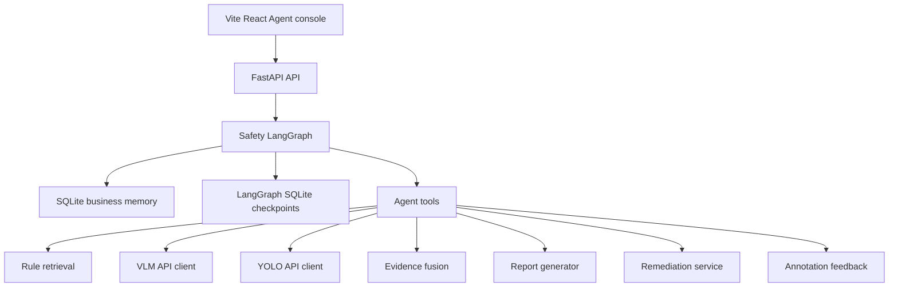
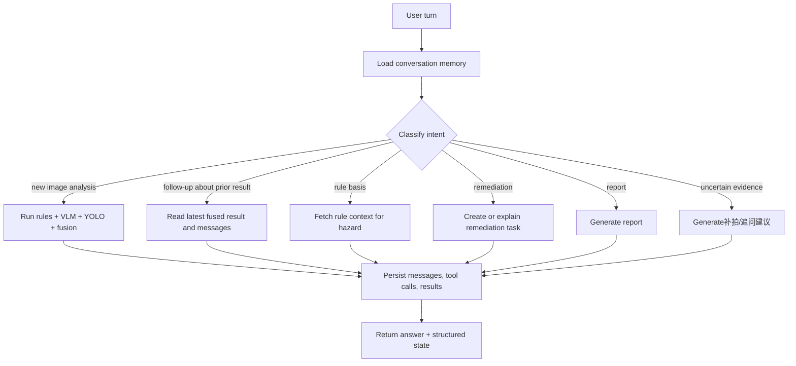

# refactor: Simplify backend stack and add LangGraph agent

## Summary

Replace the current infrastructure-heavy backend with a lightweight FastAPI + LangGraph + SQLite architecture that supports real multi-turn safety conversations, and simplify the frontend into a thin Vite React Agent console. The plan preserves the existing VLM, YOLO, rule retrieval, remediation, report, and annotation-feedback capabilities while removing SQLAlchemy, Alembic, Celery, Redis, PostgreSQL compatibility, pydantic-settings, and Next.js from the MVP path.

---

## Problem Frame

The project goal is a multi-turn construction safety expert Agent, not a one-shot image analysis endpoint. Existing documents already frame the target as an Agent that understands intent, manages memory, calls VLM/YOLO/rule/report tools, supports follow-up questions, and reuses historical results (`docs/ARCHITECTURE.md`, `docs/2026-06-03_多轮隐患识别专家Agent规划.md`).

The implementation drifted toward backend infrastructure before the Agent brain was implemented: SQLAlchemy/Alembic/Celery/Redis/PostgreSQL compatibility add operational weight, the current `SafetyExpertAgent` still runs a fixed image-analysis sequence, and the frontend uses a Next.js app for what is currently a single-page Agent console. The refactor should cut infrastructure complexity, keep the UI thin, and move complexity into the Agent orchestration layer where the product needs it.

---

## Requirements

**Agent behavior**

- R1. The backend must support multi-turn conversations that can answer follow-up questions about the current image, prior hazards, rule basis,整改建议, evidence gaps, and report requests.
- R2. The Agent must decide whether a user turn can be answered from memory or requires tool execution.
- R3. The Agent must preserve the current visual tool capabilities: VLM hazard analysis, YOLO helmet/person detection, local rule retrieval, evidence fusion, report generation, remediation creation, and annotation feedback.
- R4. The Agent must expose structured state to the UI: answer text, active conversation ID, latest fused result, tool calls, and any follow-up/remediation/report artifacts.

**Stack simplification**

- R5. The MVP backend must remove SQLAlchemy, Alembic, Celery, Redis, PostgreSQL support, and pydantic-settings from the active runtime dependency set.
- R6. SQLite must be the only MVP database, with schema creation handled by an explicit `schema.sql` and a small repository layer.
- R7. Long-running analysis must not depend on a worker queue in the MVP. Requests may execute inline, with optional later streaming or background execution deferred.
- R8. Configuration must be simple and explicit, using a small settings module backed by environment variables.
- R9. The MVP frontend must remove Next.js and become a minimal Vite React single-page Agent console.

**Persistence and memory**

- R10. Conversation messages, uploaded files, tool calls, fused results, human reviews, remediation tasks, annotation samples, and training candidates must remain persisted in SQLite.
- R11. LangGraph thread memory must use `conversation_id` as the thread identifier so follow-up turns resume the correct graph state.
- R12. Graph checkpoint state and business records must be distinguishable even when stored in the same SQLite file.

**API and UI compatibility**

- R13. The frontend must prioritize Agent backend validation over product UI breadth: upload image, send multi-turn chat messages, show answer, show latest structured result, and expose only the remediation/annotation controls needed to validate the backend loop.
- R14. Existing upload behavior and `file_id` based image safety validation must remain.
- R15. The old task-polling analysis API should be removed from the primary frontend path; retain a backend compatibility shim only if implementation discovers tests or docs still need it during migration.

**Verification**

- R16. The refactor must leave a passing backend test suite and front-end production build.
- R17. Tests must cover multi-turn memory routing, tool reuse versus re-analysis, SQLite repository behavior, key API contracts, and the thin frontend console's core upload/chat behavior.

---

## Key Technical Decisions

- KTD1. Use LangGraph as the orchestration runtime, not plain LangChain chains. LangGraph is built for long-running, stateful agents and supports persistence, human-in-the-loop workflows, memory, and routing; the official docs also state that LangGraph can be used without depending on LangChain for every component. This matches the product need for controlled state transitions rather than a generic chain abstraction.

- KTD2. Use a custom `StateGraph` rather than a prebuilt generic agent. The safety workflow has domain-specific branches: image analysis, hazard explanation, rule lookup, remediation, report generation, and annotation feedback. A custom graph makes those transitions auditable and testable.

- KTD3. Use SQLite as both business persistence and graph checkpoint storage, but keep table ownership separate. Application tables live under an explicit schema controlled by `backend/app/db/schema.sql`; LangGraph checkpoint tables are created by the checkpoint saver. This keeps the stack small without mixing graph internals with business records.

- KTD4. Keep business memory outside LangGraph checkpoint state. Checkpoints provide short-term graph state and resumption; durable product memory remains in app-owned SQLite tables so the UI, reports, reviews, and future exports do not depend on LangGraph's internal checkpoint format.

- KTD5. Remove Celery/Redis now and defer queueing until the product proves it needs it. MVP calls can execute inline through the graph, because user value depends more on correct multi-turn reasoning than worker scalability. Reintroducing a queue should be a follow-up only when concurrency, retry, or latency data justifies it.

- KTD6. Replace Next.js with Vite React for the MVP console. The frontend should be a thin local validation surface for the Agent backend, not an application framework concern. Vite React keeps TypeScript and component ergonomics while removing App Router, generated Next types, server rendering assumptions, and framework-specific build churn.

---

## High-Level Technical Design

### Target Component Topology



### Turn Routing Flow



### State Model

The graph state should remain JSON-serializable and avoid storing database connections, HTTP clients, file handles, or ORM-like objects. A state shape like this is sufficient directionally:

```text
conversation_id
user_message
file_id / image_path / selected_bbox
intent
messages
latest_analysis_id
latest_fused_result
selected_hazard_index
tool_calls
answer
artifacts
errors
```

---

## Output Structure

Expected directory shape after the refactor:

```text
backend/app/
  agent/
    graph.py
    state.py
    nodes.py
    router.py
    tools.py
    prompts.py
  api/
    routes/
      chat.py
      files.py
      annotations.py
      remediations.py
      reports.py
      reviews.py
  db/
    schema.sql
    sqlite.py
    repositories.py
  core/
    config.py
  services/
    evidence_fusion.py
    file_storage.py
    llm_client.py
    rule_retriever.py
    vlm_client.py
    yolo_detector.py

frontend/
  index.html
  package.json
  package-lock.json
  vite.config.ts
  tsconfig.json
  src/
    App.tsx
    main.tsx
    api.ts
    styles.css
```

---

## Scope Boundaries

### In Scope

- Replace the active ORM/migration/queue stack with a lightweight SQLite repository and LangGraph orchestration.
- Replace the Next.js frontend with a minimal Vite React Agent console.
- Preserve current user-facing capabilities that already exist in the prototype.
- Add enough Agent routing for multi-turn follow-ups, tool reuse, reports, remediation, and uncertainty handling.
- Update docs, requirements, backend tests, frontend tests where practical, and frontend API usage.

### Deferred to Follow-Up Work

- Streaming token-by-token UI responses.
- Reintroducing a task queue for high concurrency or long-running production workloads.
- PostgreSQL migration strategy for production.
- Vector search over historical cases.
- LangSmith tracing and hosted LangGraph deployment.
- Rich frontend product flows beyond the Agent validation console.

### Outside This Refactor

- Training or hosting VLM/YOLO models.
- Real-time video/multi-camera巡检.
- Production authentication/authorization.
- PDF report export.

---

## System-Wide Impact

This refactor changes the backend's persistence, task execution model, API behavior, dependency footprint, and frontend framework. It also removes the current migration mechanism, so local runtime databases created under the old SQLAlchemy/Alembic schema should be treated as disposable development artifacts unless a separate migration script is explicitly added during implementation.

The most important compatibility concern is frontend behavior: the current UI expects an analysis task ID and polling status. The new Vite console should move to the Agent chat response directly rather than preserving task polling.

---

## Implementation Units

### U1. Simplify Backend Dependencies and Configuration

- **Goal:** Remove unused infrastructure dependencies and replace pydantic-settings with a small explicit configuration module.
- **Requirements:** R5, R8, R16
- **Dependencies:** None
- **Files:**
  - Modify: `backend/requirements.txt`
  - Modify: `.env.example`
  - Modify: `backend/app/core/config.py`
  - Modify: `backend/README.md`
  - Modify: `docs/IMPLEMENTATION_STATUS.md`
  - Test: `backend/tests/test_config.py`
- **Approach:** Keep FastAPI, Pydantic, httpx, python-multipart, Pillow as needed, pytest for tests, and add LangGraph plus the SQLite checkpoint package. Remove SQLAlchemy, Alembic, Celery, Redis, psycopg, and pydantic-settings from active backend requirements. Replace `DATABASE_URL` with a simpler SQLite path setting unless implementation discovers a strong compatibility reason to keep the old name temporarily.
- **Patterns to follow:** Current path-normalization logic in `backend/app/core/config.py`; file-storage path safety in `backend/app/services/file_storage.py`.
- **Test scenarios:**
  - Given no environment overrides, settings resolve SQLite, upload, output, report, and rule paths under the project root.
  - Given explicit environment overrides, settings resolve configured paths without requiring pydantic-settings.
  - Given the old `.env.example` values are removed, importing backend settings does not import SQLAlchemy, Celery, Redis, or pydantic-settings.
  - Given backend dependencies are installed, importing settings does not require a database connection or external service.
- **Verification:** Backend imports cleanly; requirements contain only the simplified runtime dependencies; docs no longer instruct users to run Redis/Celery for the MVP.

### U2. Introduce SQLite Repository Layer in Parallel

- **Goal:** Create the new SQLite schema and repository layer without deleting the old ORM path yet, so the app remains importable while downstream routes migrate.
- **Requirements:** R6, R10, R12, R16
- **Dependencies:** U1
- **Files:**
  - Create: `backend/app/db/schema.sql`
  - Create: `backend/app/db/sqlite.py`
  - Modify: `backend/app/db/repositories.py`
  - Test: `backend/tests/test_sqlite_repositories.py`
- **Approach:** Define the application tables directly in `schema.sql`, initialize them through a small `sqlite.py` helper, and expose repository functions that return dictionaries or Pydantic DTOs rather than ORM entities. Preserve existing table concepts but simplify where practical. Keep graph checkpoint tables separate and do not hand-edit them. Leave `models.py`, `session.py`, `init.py`, and Alembic files in place until U5 switches active imports away from them and U7 removes them.
- **Patterns to follow:** Existing repository function names in `backend/app/db/repositories.py` where practical so route/service changes are mechanical; existing Pydantic schemas in `backend/app/models/schemas.py`.
- **Test scenarios:**
  - New database initialization creates all expected app tables.
  - Creating a conversation, message, uploaded file, tool call, fused result, remediation task, and annotation sample round-trips through repositories.
  - Latest-result lookups return the newest record for a given analysis ID.
  - Repository functions close connections and do not leak sqlite cursors across calls.
- **Verification:** New SQLite repository tests pass while the existing app still imports; no deletion happens in this unit.

### U3. Build Business Memory and Agent Tool Wrappers

- **Goal:** Provide LangGraph nodes with stable tools for memory reads/writes and existing safety capabilities.
- **Requirements:** R2, R3, R4, R10, R14
- **Dependencies:** U2
- **Files:**
  - Create: `backend/app/services/memory.py`
  - Create: `backend/app/agent/tools.py`
  - Modify: `backend/app/services/rule_retriever.py`
  - Modify: `backend/app/services/vlm_client.py`
  - Modify: `backend/app/services/yolo_detector.py`
  - Modify: `backend/app/services/evidence_fusion.py`
  - Modify: `backend/app/services/report_generator.py`
  - Test: `backend/tests/test_agent_tools.py`
- **Approach:** Wrap current services into tool functions with uniform input/output records. Each tool should record tool-call metadata through the SQLite repository. Memory tools should retrieve recent messages, latest uploaded image, latest fused result, hazard by index, existing remediation tasks, and report history.
- **Patterns to follow:** `timed_tool_call` behavior from the existing repository layer, but implemented without SQLAlchemy.
- **Test scenarios:**
  - Rule retrieval tool returns rule blocks and records a successful tool call.
  - VLM/YOLO tools return configured fallback responses when API URLs are absent and still record calls.
  - VLM/YOLO timeout or HTTP error records an error tool call and returns enough structured detail for the graph to respond safely.
  - Memory lookup for "第 2 个隐患" resolves the second hazard from the latest fused result.
  - Tool errors persist error status and propagate enough detail for the graph to produce a user-facing failure response.
- **Verification:** Agent tools can be called independently in tests without FastAPI request context.

### U4. Introduce LangGraph Safety Agent

- **Goal:** Replace fixed-order `SafetyExpertAgent` orchestration with a stateful LangGraph that routes user turns through memory, intent classification, tool execution, and response generation.
- **Requirements:** R1, R2, R3, R4, R11, R17
- **Dependencies:** U1, U2, U3
- **Files:**
  - Create: `backend/app/agent/state.py`
  - Create: `backend/app/agent/router.py`
  - Create: `backend/app/agent/nodes.py`
  - Create: `backend/app/agent/graph.py`
  - Create: `backend/app/agent/prompts.py`
  - Modify: `backend/app/agents/safety_expert.py`
  - Test: `backend/tests/test_agent_graph.py`
- **Approach:** Build a `StateGraph` with explicit nodes for loading context, classifying intent, running image analysis, answering from memory, retrieving rule basis, generating remediation/report responses, persisting outputs, and formatting the final response. Use `conversation_id` as LangGraph `thread_id`. The intent classifier can start with deterministic rules plus optional LLM classification through a lightweight OpenAI-compatible `LLMClient`; implementation should not require a configured LLM to pass tests.
- **Patterns to follow:** Existing `SafetyExpertAgent.handle` response contract; existing schemas in `backend/app/models/schemas.py`.
- **Test scenarios:**
  - First turn with an uploaded image routes through analysis tools and persists fused results.
  - Follow-up "刚才第 2 个隐患依据是什么？" answers from memory without re-running VLM/YOLO.
  - Follow-up "怎么整改？" uses latest hazard context and returns remediation-oriented advice.
  - "生成报告" routes to report generation using existing results.
  - No image and no prior image returns a clear prompt to upload an image.
  - Tool failure produces a bounded user-facing answer and records error details.
  - VLM/YOLO timeout does not leave partially persisted success state.
- **Verification:** Graph tests prove at least one multi-turn conversation uses the same `conversation_id` and reuses prior state.

### U5. Migrate API Routes to Agent-Centric Flow

- **Goal:** Make the HTTP API expose the LangGraph Agent as the primary interaction model and remove Celery task behavior from active endpoints.
- **Requirements:** R4, R7, R13, R14, R15, R16
- **Dependencies:** U2, U3, U4
- **Files:**
  - Modify: `backend/app/api/routes/chat.py`
  - Modify: `backend/app/api/routes/analysis.py`
  - Modify: `backend/app/api/routes/files.py`
  - Modify: `backend/app/api/routes/reports.py`
  - Modify: `backend/app/api/routes/remediations.py`
  - Modify: `backend/app/api/routes/annotations.py`
  - Modify: `backend/app/main.py`
  - Modify: `backend/app/models/schemas.py`
  - Modify: `docs/API_CONTRACTS.md`
  - Test: `backend/tests/test_api_chat.py`
- **Approach:** Prefer a single Agent-backed chat endpoint for normal interactions. Define explicit `AgentChatRequest` and `AgentChatResponse` schemas covering `conversation_id`, `message`, optional `file_id`, optional `selected_bbox`, answer text, latest fused result, tool calls, analysis/report/remediation artifacts, and error metadata. Either remove `/api/analysis/tasks/{task_id}` from the frontend path or retain a compatibility response that reports completed inline results without Celery. Keep upload validation and `file_id` safety checks. Ensure reports, remediations, reviews, and annotation endpoints use the new SQLite repositories.
- **Patterns to follow:** Current route modules and Pydantic response model style.
- **Test scenarios:**
  - POST chat with `file_id` returns answer, conversation ID, fused result, and tool calls.
  - POST chat follow-up with the same conversation ID returns memory-based answer.
  - Invalid `file_id` returns the existing uploaded-file error behavior.
  - External tool timeout returns a bounded API error or degraded Agent response without hanging the request indefinitely.
  - Legacy analysis endpoint, if retained, does not import Celery and returns a documented compatibility response.
  - Remediation and annotation endpoints still validate target analysis/hazard records through SQLite repositories.
- **Verification:** Importing `app.main` does not import Celery, Redis, SQLAlchemy, Alembic, or psycopg.

### U6. Replace Next.js With a Thin Vite Agent Console

- **Goal:** Replace the existing Next.js app with a minimal Vite React console focused on validating the Agent backend.
- **Requirements:** R4, R9, R13, R14, R15, R16, R17
- **Dependencies:** U5
- **Files:**
  - Create: `frontend/index.html`
  - Create: `frontend/vite.config.ts`
  - Create: `frontend/src/main.tsx`
  - Create: `frontend/src/App.tsx`
  - Create: `frontend/src/api.ts`
  - Create: `frontend/src/styles.css`
  - Create: `frontend/src/App.test.tsx`
  - Modify: `frontend/package.json`
  - Modify: `frontend/package-lock.json`
- **Approach:** Build a thin single-page console with upload, chat messages, current conversation ID, latest structured result, and minimal buttons for remediation/annotation validation. After upload, send chat turns with `conversation_id`, `file_id` when available, and user message. Replace task polling state with request/loading state and latest Agent response state. Avoid broad product UI work until the backend Agent loop is solid.
- **Patterns to follow:** Preserve useful current UI behavior from `frontend/src/app/page.tsx`: `requireOk`, upload flow, `file_id` state, result panel sections, and simple message list.
- **Test scenarios:**
  - Upload sets `file_id` and enables chat submission.
  - First analysis displays answer and structured result without polling.
  - Follow-up turn sends the same conversation ID and does not require re-upload.
  - Error response from the Agent endpoint is shown in the message list.
  - Annotation/remediation buttons continue to use the latest analysis context returned by the Agent.
- **Verification:** Vite production build passes, frontend tests cover upload/chat/error rendering, the UI contains no Next.js imports or generated files, and the UI no longer references Celery task status as the primary flow.

### U7. Remove Retired Infrastructure and Update Project Documentation

- **Goal:** Delete or retire obsolete infrastructure files and make docs match the simplified Agent architecture.
- **Requirements:** R5, R7, R15, R16
- **Dependencies:** U1, U2, U5, U6
- **Files:**
  - Modify: `README.md`
  - Modify: `docs/ARCHITECTURE.md`
  - Modify: `docs/API_CONTRACTS.md`
  - Modify: `docs/IMPLEMENTATION_STATUS.md`
  - Modify: `docs/ROADMAP.md`
  - Delete or archive: `backend/alembic/`
  - Delete or archive: `backend/alembic.ini`
  - Delete or archive: `backend/app/tasks/`
  - Delete or archive: `backend/app/db/models.py`
  - Delete or archive: `backend/app/db/session.py`
  - Delete or archive: `backend/app/db/init.py`
  - Delete or archive: `frontend/src/app/`
  - Delete or archive: `frontend/next.config.js`
  - Delete or archive: `frontend/next-env.d.ts`
  - Test: `backend/tests/test_no_retired_imports.py`
- **Approach:** Remove instructions for Redis, Celery worker, Alembic, PostgreSQL, psycopg, and Next.js from MVP docs. Document the simplified startup path, LangGraph Agent flow, SQLite storage model, Vite console, and explicit deferred items.
- **Patterns to follow:** Existing Chinese docs style in `README.md` and `docs/ARCHITECTURE.md`.
- **Test scenarios:**
  - Static import scan confirms no active backend module imports `celery`, `redis`, `sqlalchemy`, `alembic`, `psycopg`, or `pydantic_settings`.
  - Docs mention LangGraph and SQLite as MVP defaults.
  - Docs identify queueing/PostgreSQL/vector search/rich frontend work as deferred follow-up work, not current setup requirements.
- **Verification:** A new developer can start backend and frontend from the docs without installing Redis, starting a worker, or using Next.js.

---

## Acceptance Examples

- AE1. Given a user uploads an image and asks "分析这张图有没有隐患", when the Agent receives the turn, then it runs rule retrieval, VLM, YOLO, fusion, persists the result, and returns an answer plus structured hazards/detections.
- AE2. Given AE1 has completed in a conversation, when the user asks "刚才第 2 个隐患依据是什么", then the Agent answers from the latest fused result and rule context without re-running VLM/YOLO.
- AE3. Given a fused result has an `uncertain` item, when the user asks "还需要补什么证据", then the Agent returns a targeted follow-up question and capture suggestion.
- AE4. Given a confirmed hazard exists, when the user asks "帮我生成整改任务", then the Agent creates or explains a remediation task using that hazard's context.
- AE5. Given no image exists in the conversation, when the user asks for image analysis, then the Agent asks for an upload instead of calling visual tools.

---

## Risks & Dependencies

- **LangGraph package churn:** LangGraph APIs are actively evolving. Use current official docs and pin compatible package versions during implementation.
- **Checkpoint table growth:** LangGraph checkpointing can grow quickly in long conversations. MVP should keep graph state compact and store large analysis payloads in business tables.
- **Loss of queue semantics:** Removing Celery means long VLM/YOLO calls occupy the request path. This is acceptable for MVP, but production may later need streaming, background execution, or a queue.
- **Repository rewrite risk:** Removing SQLAlchemy touches many routes and services. Characterization tests should land before deleting old code paths.
- **Local database reset:** The plan assumes current runtime data is disposable development data. Production migration is deferred.
- **LLM router dependency:** Intent routing should have deterministic fallback behavior so tests and local demos do not require an LLM key.

---

## Documentation and Operational Notes

Update startup docs to describe a two-process MVP: FastAPI backend and Vite React frontend. Remove Redis/Celery worker and Next.js instructions from the main quick start. Document environment variables for external VLM/YOLO/LLM APIs, SQLite path, upload/output/report directories, and rule blocks path.

The docs should explicitly say that LangGraph manages conversation flow and short-term graph state, while SQLite app tables store business records and training-feedback artifacts.

---

## Sources & Research

- Existing project intent and scope: `docs/ARCHITECTURE.md`, `docs/API_CONTRACTS.md`, `docs/IMPLEMENTATION_STATUS.md`, `docs/2026-06-03_多轮隐患识别专家Agent规划.md`.
- Current fixed-flow Agent implementation: `backend/app/agents/safety_expert.py`.
- Current infrastructure-heavy repository layer and frontend stack: `backend/app/db/repositories.py`, `backend/app/db/models.py`, `backend/app/tasks/analysis_tasks.py`, `backend/requirements.txt`, `frontend/package.json`, `frontend/src/app/page.tsx`.
- LangGraph overview: https://docs.langchain.com/oss/python/langgraph/overview. Load-bearing findings: LangGraph is a low-level orchestration runtime for stateful agents; it can be used without LangChain; persistence, memory, and human-in-the-loop are core capabilities.
- LangGraph persistence: https://docs.langchain.com/oss/python/langgraph/persistence. Load-bearing findings: checkpointers save graph state by thread; `thread_id` is required for memory and resumption.
- LangGraph workflows and agents: https://docs.langchain.com/oss/python/langgraph/workflows-agents. Load-bearing findings: routing workflows and explicit `StateGraph` nodes fit domain-specific branching.
- LangGraph SQLite checkpointer package: https://pypi.org/project/langgraph-checkpoint-sqlite/. Load-bearing finding: SQLite checkpoint persistence is available as a separate package.
- Vite guide: https://vite.dev/guide/. Load-bearing finding: Vite officially supports a `react-ts` template, which matches the target thin React + TypeScript console without a meta-framework.
