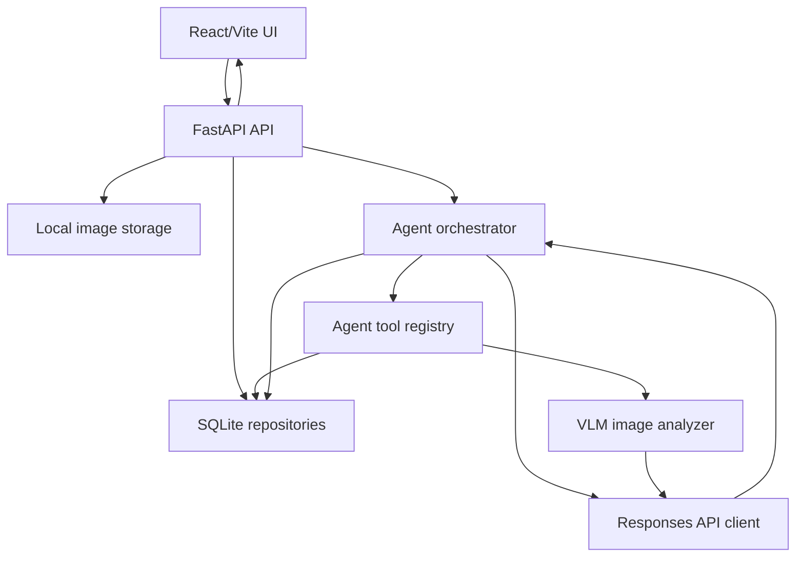
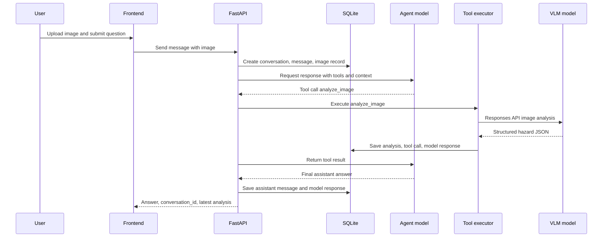
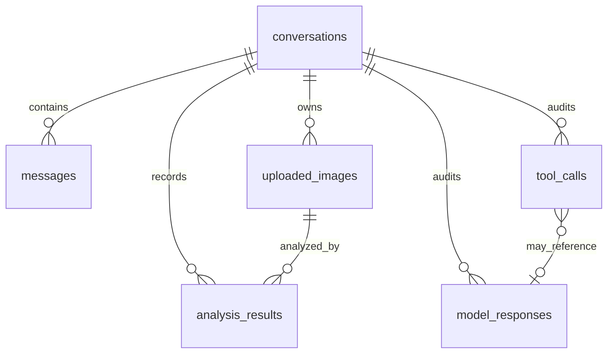
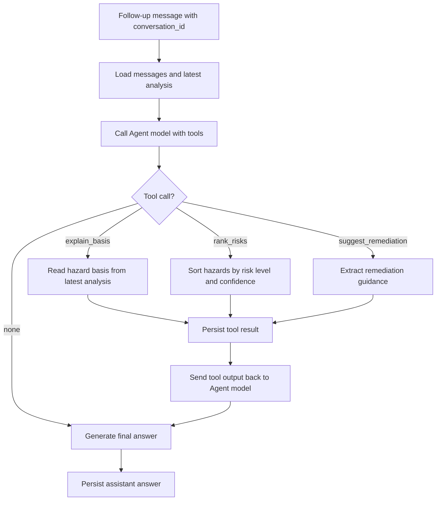

# feat: Build v0.1 construction safety Agent MVP

## Summary

Build the first runnable version of the construction-site safety hazard identification Agent from a clean slate. v0.1 creates a FastAPI backend, React/Vite frontend, SQLite persistence, OpenAI-compatible Responses API integration, model tool calling, and a single-image follow-up flow.

---

## Problem Frame

The repository has intentionally been cleared so the product can be rebuilt incrementally. The first implementation must prove the smallest useful Agent loop: a local user uploads one construction-site image, a real VLM returns structured hazard JSON, and the Agent answers follow-up questions about basis, risk ranking, and remediation using saved conversation context.

This plan implements only v0.1 from `docs/requirements/v0.1-mvp.md`. Later capabilities in `docs/roadmap.md`, such as multi-image comparison, rule references, reports, review workflows, remediation tasks, and annotation feedback, stay out of this work.

---

## Requirements

**Local app foundation**

- R1. The project provides a runnable FastAPI backend and React/Vite frontend for a local single-user demo.
- R2. The backend exposes enough API surface for image upload, initial image analysis, and follow-up messages in one conversation.
- R3. Configuration supports `OPENAI_API_BASE_URL`, `OPENAI_API_KEY`, `VLM_MODEL`, and `AGENT_MODEL`, with validation that fails clearly when required values are missing.

**Image and VLM analysis**

- R4. The user can upload one construction-site image through the web UI.
- R5. The backend stores uploaded image files locally and records image metadata in SQLite.
- R6. The backend calls a real OpenAI-compatible Responses API VLM model for image analysis.
- R7. The VLM output is forced into a structured hazard JSON shape and validated before it is used by downstream Agent tools.

**Agent behavior**

- R8. The Agent model uses Responses API tool calling to select at least the initial `analyze_image` path.
- R9. The v0.1 tool set is limited to `analyze_image`, `explain_basis`, `rank_risks`, and `suggest_remediation`.
- R10. Follow-up questions in the same conversation can answer basis explanation, risk ranking, and remediation suggestions using saved analysis state.

**Persistence and audit**

- R11. SQLite stores conversations, messages, uploaded image metadata, structured analysis results, tool calls, and model responses.
- R12. v0.1 stores full local audit memory, including raw Agent/VLM responses and model/API errors, for debugging.

**Frontend experience**

- R13. The frontend shows the conversation transcript, upload state, latest assistant answer, and structured hazard list.
- R14. The frontend handles loading and error states clearly enough for local repeated testing.

**Verification**

- R15. Backend tests cover configuration, SQLite persistence, image validation/storage, VLM JSON parsing, Agent tool execution, and API conversation flow.
- R16. Frontend tests cover upload/submission state, transcript rendering, structured hazard rendering, and API error handling.

---

## Key Technical Decisions

- KTD1. **Use a greenfield but conventional split:** keep backend and frontend as separate top-level apps under `backend/` and `frontend/`. This matches the requested stack while keeping v0.1 easy to run and extend.
- KTD2. **Use one chat-style API for UI workflow:** implement a primary conversation endpoint that can accept a message plus optional image upload rather than separating the first turn and follow-up turn into unrelated APIs. This keeps the frontend simple and preserves one conversation mental model.
- KTD3. **Use the official OpenAI Python SDK behind a local client wrapper:** v0.1 should call Responses API through the official SDK first, with all provider-specific request assembly and response traversal hidden in `backend/app/services/responses_client.py`. If a later OpenAI-compatible provider needs raw HTTP or adapter behavior, it should be isolated behind this wrapper.
- KTD4. **Store uploaded images locally and send VLM input as base64 data URLs:** local storage gives SQLite stable file metadata, while base64 image input avoids adding a file-upload-to-provider lifecycle in v0.1. The exact request object must follow the current Responses API image input shape.
- KTD5. **Use strict structured output for VLM hazard JSON when supported:** request the hazard schema through Responses API structured output / JSON Schema support when the selected provider supports it. Prompt-only JSON is not sufficient as the primary path. If the provider cannot enforce the schema, the analyzer must record the limitation and fail or use an explicit documented fallback instead of silently accepting free-form text.
- KTD6. **Validate VLM JSON with server-side schemas:** model-side structure is not trusted on its own. The backend must validate and reject or record malformed data rather than letting invalid hazard objects enter Agent state.
- KTD7. **Let Responses API tool calling drive Agent tool selection:** v0.1 should be a real tool-calling Agent, not only a deterministic router. The backend still owns tool execution, persistence, validation, and loop limits.
- KTD8. **Use SQLite with explicit repository functions:** avoid introducing ORM/migration complexity in v0.1. A checked-in schema plus small repository layer is enough for local persistence and tests.
- KTD9. **Persist complete local audit records by default:** this matches the requirement for v0.1 debugging. The plan treats retention/redaction as a later production hardening topic, not a v0.1 blocker.
- KTD10. **Keep business tools deterministic after analysis:** `explain_basis`, `rank_risks`, and `suggest_remediation` should primarily transform the stored structured analysis. The Agent model chooses tools and writes final answers; these tools should not each trigger extra model calls in v0.1.

---

## High-Level Technical Design

### Component Topology



### First-Turn Sequence



### SQLite Relationships



### Follow-Up Sequence



---

## Output Structure

Expected greenfield layout:

```text
backend/
  app/
    agent/
    api/
    core/
    db/
    models/
    services/
  tests/
frontend/
  src/
docs/
  plans/
  requirements/
runtime/
  uploads/
```

The tree is the intended shape for v0.1. Implementation may add small support files when standard tooling requires them.

---

## Scope Boundaries

### In Scope

- Single-image upload and analysis.
- OpenAI-compatible Responses API integration for both VLM and Agent model roles.
- Agent model tool calling with four approved tools.
- SQLite persistence with complete local audit records.
- Minimal but usable web UI.
- Local development and test setup.

### Deferred to Follow-Up Work

- Multi-image comparison.
- Stronger malformed JSON repair and retry loops beyond a clear v0.1 failure path.
- Local rule blocks, standard references, and regulation citation retrieval.
- Report generation.
- Human review and correction workflow.
- Remediation task tracking.
- Annotation feedback and training candidate export.
- Authentication, user isolation, data retention, and privacy hardening.
- Deployment automation.

### Outside v0.1

- Production safety/legal compliance claims.
- Replacing professional safety inspection judgment.
- Full project management or issue tracking workflows.

---

## Implementation Units

### U1. Project Scaffold And Configuration

**Goal:** Create the backend/frontend project scaffold, dependency manifests, environment example, and configuration validation needed for local development.

**Requirements:** R1, R3.

**Dependencies:** None.

**Files:**

- `.gitignore`
- `.env.example`
- `README.md`
- `backend/requirements.txt`
- `backend/app/__init__.py`
- `backend/app/main.py`
- `backend/app/core/__init__.py`
- `backend/app/core/config.py`
- `backend/tests/test_config.py`
- `frontend/package.json`
- `frontend/index.html`
- `frontend/vite.config.ts`
- `frontend/tsconfig.json`
- `frontend/src/main.tsx`
- `frontend/src/vite-env.d.ts`

**Approach:** Use FastAPI, Pydantic, pytest, httpx, and the official OpenAI Python SDK or a small HTTP client compatible with Responses API. Use React/Vite with TypeScript. Keep configuration centralized in `backend/app/core/config.py`, reading from environment variables and `.env` during local development. Fail startup or client construction clearly when required model/API values are missing.

**Patterns to follow:** Greenfield conventional FastAPI app layout and Vite TypeScript app layout. Since prior project code was intentionally removed, do not resurrect old modules except as conceptual precedent from `docs/requirements/v0.1-mvp.md`.

**Test scenarios:**

- Happy path: when all required environment variables are set, config loads `OPENAI_API_BASE_URL`, `OPENAI_API_KEY`, `VLM_MODEL`, and `AGENT_MODEL`.
- Error path: when `OPENAI_API_KEY` is missing, config validation reports a clear missing-key error.
- Error path: when either model name is missing, config validation reports which model field is missing.

**Verification:** Backend and frontend scaffolds can be installed by their package managers, config tests pass, and the README explains local setup without referring to removed legacy files.

### U2. SQLite Schema And Repository Layer

**Goal:** Add durable local persistence for conversations, messages, uploaded images, analysis results, tool calls, and model responses.

**Requirements:** R5, R11, R12.

**Dependencies:** U1.

**Files:**

- `backend/app/db/__init__.py`
- `backend/app/db/schema.sql`
- `backend/app/db/sqlite.py`
- `backend/app/db/repositories.py`
- `backend/tests/test_repositories.py`

**Approach:** Use SQLite directly with explicit schema initialization. Store JSON payloads as text columns with repository-level serialization. Include created/updated timestamps where useful. Keep foreign keys enabled. Store full raw model responses and errors in `model_responses` for v0.1 local audit, with fields that identify model role, provider response ID when available, status, raw JSON/text, and error text.

**Patterns to follow:** Small repository functions per aggregate: conversation, message, uploaded image, analysis result, tool call, model response. Avoid ORM and migration tooling in v0.1.

**Test scenarios:**

- Happy path: initializing a new SQLite file creates all required tables.
- Happy path: creating a conversation and messages persists records in chronological order.
- Happy path: saving uploaded image metadata links it to the correct conversation.
- Happy path: saving an analysis result preserves the structured hazard JSON.
- Happy path: saving tool calls and model responses preserves status, timestamps, and raw payload fields.
- Edge case: repository calls reject or surface missing foreign-key references instead of creating orphan records.

**Verification:** Repository tests use temporary SQLite files and prove all v0.1 audit entities can be inserted and read back.

### U3. Domain Schemas And Validation

**Goal:** Define typed request/response and hazard-analysis schemas shared by API, Agent tools, VLM parsing, and frontend contracts.

**Requirements:** R2, R7, R10, R13.

**Dependencies:** U1.

**Files:**

- `backend/app/models/__init__.py`
- `backend/app/models/schemas.py`
- `backend/tests/test_schemas.py`
- `frontend/src/types.ts`

**Approach:** Define Pydantic models for `Hazard`, `AnalysisResult`, chat responses, tool call summaries, and API errors. Mirror the API-facing TypeScript types in `frontend/src/types.ts`. Keep v0.1 hazard fields exactly aligned with the requirements: `name`, `location`, `risk_level`, `basis`, `remediation`, and `confidence`, plus result-level `summary`, `hazards`, `needs_followup`, and `followup_question`.

**Patterns to follow:** Pydantic validation for backend boundaries; TypeScript interfaces for frontend rendering. Keep risk levels as a constrained enum.

**Test scenarios:**

- Happy path: a valid structured VLM response parses into an analysis result.
- Edge case: `confidence` outside `0.0` to `1.0` fails validation.
- Edge case: unknown `risk_level` fails validation.
- Edge case: empty hazards list is accepted only when summary and follow-up state make the result meaningful.
- Error path: malformed JSON from a model response is captured as a parse failure instead of becoming an analysis result.

**Verification:** Schema tests prove the structured output contract is enforceable before any Agent or UI code relies on it.

### U4. Image Storage And Upload API

**Goal:** Accept one image from the frontend, validate it, store it under local runtime storage, and record metadata.

**Requirements:** R2, R4, R5.

**Dependencies:** U1, U2, U3.

**Files:**

- `backend/app/services/__init__.py`
- `backend/app/services/image_storage.py`
- `backend/tests/test_image_storage.py`

**Approach:** Use a local `runtime/uploads/` directory ignored by git. Validate MIME type and size before storage. Generate safe server-side filenames rather than trusting client filenames. Keep this unit service-focused; the full HTTP chat route is wired in U8.

**Patterns to follow:** Treat file storage as a service separate from API routing so it can be tested without HTTP.

**Test scenarios:**

- Happy path: valid JPEG or PNG upload is stored with a generated filename and metadata record.
- Happy path: image storage returns a stable local path, MIME type, byte size, and generated filename for repository persistence.
- Error path: unsupported MIME type returns a clear client error.
- Error path: oversized image returns a clear client error and does not create an uploaded image record.
- Error path: unsafe original filenames do not affect the stored path.

**Verification:** Service tests confirm image validation and storage behavior without calling external models or HTTP routes.

### U5. Responses API Client And VLM Analyzer

**Goal:** Implement the OpenAI-compatible Responses API client path for image analysis and enforce structured VLM output parsing.

**Requirements:** R6, R7, R12.

**Dependencies:** U1, U2, U3, U4.

**Files:**

- `backend/app/services/responses_client.py`
- `backend/app/services/vlm_analyzer.py`
- `backend/app/agent/prompts.py`
- `backend/tests/test_responses_client.py`
- `backend/tests/test_vlm_analyzer.py`

**Approach:** Create a small client abstraction around the official OpenAI Python SDK so tests can replace it without network access. For image analysis, read the stored image, encode it as a base64 data URL, send it with an image-analysis prompt, and request strict structured JSON matching the hazard schema when the provider supports Responses API JSON Schema output. Persist raw VLM responses and errors through the repository layer. On malformed JSON, schema validation failure, or provider lack of structured-output support, save the raw response or limitation and return a typed failure unless an explicit fallback is documented during implementation.

**Patterns to follow:** Keep provider-specific SDK calls, request assembly, and response traversal inside `responses_client.py`; keep construction-safety prompt and parse/validation logic inside `vlm_analyzer.py`.

**Test scenarios:**

- Happy path: a mocked Responses API VLM response with valid JSON produces an `AnalysisResult`.
- Happy path: the image request includes an image input and the configured `VLM_MODEL`.
- Happy path: the VLM request includes the structured-output schema or records that the selected provider cannot enforce it.
- Error path: API failure records a model response error and returns a typed analyzer failure.
- Error path: natural-language model output fails validation and records the raw response.
- Error path: JSON missing required hazard fields fails validation.
- Edge case: no hazards with `needs_followup: true` and a follow-up question is accepted when schema-valid.

**Verification:** Tests verify request assembly at the client boundary and parsing behavior without making live API calls.

### U6. Agent Tool Registry And Tool Implementations

**Goal:** Implement the four v0.1 tools and keep their behavior grounded in stored structured analysis.

**Requirements:** R8, R9, R10, R11, R12.

**Dependencies:** U2, U3, U5.

**Files:**

- `backend/app/agent/__init__.py`
- `backend/app/agent/tools.py`
- `backend/tests/test_agent_tools.py`

**Approach:** Define tool schemas for `analyze_image`, `explain_basis`, `rank_risks`, and `suggest_remediation` in the format expected by Responses API tool calling. Implement backend handlers for each tool. `analyze_image` delegates to the VLM analyzer. The other three tools read the latest analysis result for the conversation and return concise structured tool outputs. Save every tool call input, output, status, and duration.

**Patterns to follow:** Keep tool definitions and tool execution registry together, but keep VLM-specific logic in `vlm_analyzer.py`. Business tools should be deterministic transformations of `AnalysisResult` in v0.1.

**Test scenarios:**

- Happy path: `analyze_image` calls the VLM analyzer and saves a successful tool call.
- Happy path: `explain_basis` returns hazard names, locations, and basis fields from the latest analysis.
- Happy path: `rank_risks` sorts `critical`, `high`, `medium`, `low`, using confidence as a secondary signal.
- Happy path: `suggest_remediation` returns remediation guidance for all hazards or a selected hazard when the tool input identifies one.
- Error path: follow-up tools return a clear no-analysis-available result when the conversation has no saved analysis.
- Error path: an unknown tool name is rejected and recorded as a failed tool call.

**Verification:** Tool tests prove each tool can be executed independently of the Agent model.

### U7. Agent Orchestrator With Responses Tool Calling

**Goal:** Build the Agent loop that sends conversation context and tool definitions to the Agent model, executes requested tools, returns tool outputs, and persists the final assistant response.

**Requirements:** R8, R9, R10, R11, R12.

**Dependencies:** U2, U3, U6.

**Files:**

- `backend/app/agent/orchestrator.py`
- `backend/app/agent/context.py`
- `backend/app/agent/prompts.py`
- `backend/tests/test_agent_orchestrator.py`

**Approach:** Assemble a bounded tool-calling loop. The orchestrator loads recent messages, latest analysis result, and image metadata; calls the Agent model with `AGENT_MODEL` and tool definitions; executes tool calls through the registry; sends tool outputs back to the model; and persists the final assistant message. Set a small maximum tool-iteration count to avoid loops. Persist raw Agent model responses and errors in `model_responses`.

**Patterns to follow:** Separate context assembly from orchestration. Keep prompt text explicit about construction-site safety scope, uncertainty, and not inventing hazards beyond available evidence.

**Test scenarios:**

- Happy path: initial message with image leads to an Agent tool call for `analyze_image`, tool execution, and final assistant answer.
- Happy path: follow-up asking "哪个最严重" leads to `rank_risks` and final answer using tool output.
- Happy path: follow-up asking "依据是什么" leads to `explain_basis`.
- Happy path: follow-up asking "怎么整改" leads to `suggest_remediation`.
- Edge case: Agent returns no tool call and a direct final answer; the answer is saved.
- Error path: Agent requests a tool that fails; failure is persisted and surfaced in a controlled assistant response.
- Error path: Agent exceeds max tool iterations; loop stops and records an error.

**Verification:** Orchestrator tests use mocked Responses API responses and mocked tools to prove the loop and persistence behavior.

### U8. Chat API Contract

**Goal:** Expose the backend conversation workflow to the frontend through a stable v0.1 API.

**Requirements:** R2, R4, R8, R10, R11, R13, R14.

**Dependencies:** U4, U7.

**Files:**

- `backend/app/api/routes/chat.py`
- `backend/app/main.py`
- `backend/tests/test_chat_api.py`
- `README.md`

**Approach:** Wire FastAPI route registration, CORS for local frontend development, and response models. The main endpoint should return `conversation_id`, assistant answer, latest structured analysis result when available, tool call summaries or debug metadata, and errors in a frontend-friendly shape. Keep API docs in `README.md` concise and aligned with v0.1.

**Patterns to follow:** Keep route handlers thin: validation, service invocation, response mapping. Agent orchestration remains in `backend/app/agent/orchestrator.py`.

**Test scenarios:**

- Happy path: first request with image and message returns `conversation_id`, answer, and latest analysis.
- Happy path: follow-up request with `conversation_id` and no image returns an answer using prior context.
- Error path: missing message returns a validation error.
- Error path: unknown `conversation_id` returns a clear not-found or invalid-conversation response.
- Error path: Agent service failure returns a controlled API error and persists what can be persisted.
- Integration scenario: first request followed by follow-up request in the same test reuses the saved analysis.

**Verification:** API tests exercise the HTTP layer with mocked Agent model calls and temporary SQLite storage.

### U9. Minimal React/Vite Frontend

**Goal:** Build the local web UI for image upload, question submission, transcript display, structured hazard display, and error/loading states.

**Requirements:** R1, R4, R13, R14, R16.

**Dependencies:** U1, U3, U8.

**Files:**

- `frontend/src/App.tsx`
- `frontend/src/api.ts`
- `frontend/src/types.ts`
- `frontend/src/styles.css`
- `frontend/src/App.test.tsx`
- `frontend/src/test-setup.ts`

**Approach:** Build a single-screen application focused on the real workflow rather than a landing page. Include an image picker, message input, submit action, transcript area, latest analysis panel, and tool/debug summary area if returned by the API. Keep visual density moderate and avoid dashboard features that belong to later versions.

**Patterns to follow:** Use plain React state and typed API helpers. Avoid adding routing or global state libraries for v0.1.

**Test scenarios:**

- Happy path: selecting an image and submitting a message calls the chat API with multipart data.
- Happy path: successful API response renders assistant answer and structured hazards.
- Happy path: follow-up message after the first response sends `conversation_id` without requiring another image.
- Edge case: submit is disabled or guarded while no message is present.
- Error path: API error renders a visible error state without clearing the transcript.
- Error path: request in progress shows a loading state and prevents duplicate submit.

**Verification:** Frontend tests validate the core UI states and API helper behavior with mocked fetch.

### U10. Documentation And Local Verification Surface

**Goal:** Document how to run, configure, test, and understand v0.1 without relying on the deleted legacy project.

**Requirements:** R1, R3, R15, R16.

**Dependencies:** U1 through U9.

**Files:**

- `README.md`
- `.env.example`
- `.gitignore`
- `docs/requirements/v0.1-mvp.md`
- `docs/roadmap.md`
- `docs/plans/2026-06-05-001-feat-v01-agent-mvp-plan.md`

**Approach:** Update the README with the rebuilt project purpose, v0.1 scope, local setup, environment variables, backend/frontend run instructions, test commands, and known limitations. Ensure `.gitignore` excludes local runtime files, SQLite databases, uploads, virtualenvs, node modules, and build outputs.

**Patterns to follow:** Keep docs aligned with the incremental rebuild philosophy: v0.1 is a real Agent MVP, not the final product.

**Test scenarios:** Test expectation: none -- this unit documents and configures the implemented surface rather than adding behavior. Verification comes from the tests and run instructions created in prior units.

**Verification:** A new reader can understand what v0.1 includes, what it excludes, and how to start backend and frontend locally.

---

## Acceptance Examples

- AE1. Given a local user opens the frontend, when they upload one valid construction-site image and ask "请识别这张图的安全隐患", then the app returns an assistant answer, a `conversation_id`, and a structured hazard list.
- AE2. Given the first turn has produced a hazard list, when the user asks "判断依据是什么?", then the Agent answers from the saved `basis` fields and does not require another image.
- AE3. Given the first turn has produced multiple hazards, when the user asks "哪个隐患最严重?", then the Agent ranks hazards by risk level and explains the priority order.
- AE4. Given the first turn has produced hazards, when the user asks "应该怎么整改?", then the Agent returns remediation suggestions grounded in the saved analysis.
- AE5. Given the VLM returns malformed JSON, when the backend attempts to parse it, then the raw response is saved for audit and the user receives a controlled error instead of a broken UI.

---

## System-Wide Impact

This plan creates the full initial application surface: backend API, frontend UI, persistence, local file storage, external model integration, and tests. It also establishes the project's future extension points: tool registry, Responses API client abstraction, typed analysis schema, repository layer, and local audit model.

The main operational impact is that v0.1 stores raw uploaded images and complete model responses locally. This is acceptable for the requested local MVP but must be revisited before real user data or production deployment.

---

## Risks And Dependencies

- **Responses API compatibility risk:** OpenAI-compatible providers may differ in tool-calling, image input, or structured-output support. Mitigation: isolate request assembly in `responses_client.py` and test against mocked provider responses; document provider assumptions in README.
- **Malformed VLM output risk:** Even with structured-output prompting, models can fail or providers can return nonconforming output. Mitigation: schema validation, controlled error responses, and full raw response persistence.
- **Agent loop risk:** Tool-calling loops can repeat or choose inappropriate tools. Mitigation: bounded iterations, approved tool registry, persisted tool calls, and focused orchestrator tests.
- **Privacy/audit risk:** Full local audit memory stores sensitive image and model-response data. Mitigation: keep v0.1 local-only, ignore runtime data in git, and defer retention/redaction to production-oriented versions.
- **Frontend/API contract drift:** Greenfield backend and frontend can diverge. Mitigation: shared conceptual schema, TypeScript API types, and API tests plus frontend mocked-response tests.

---

## Documentation And Operational Notes

- `.env.example` should show required model/API variables without real secrets.
- `runtime/` should be ignored by git and used for uploaded images and SQLite database files.
- README should state that v0.1 is local single-user software and not a production safety compliance system.
- Live model calls should not be required for normal automated tests; unit and API tests should mock Responses API boundaries.
- Final v0.1 acceptance should include one manual smoke test with real configured `VLM_MODEL` and `AGENT_MODEL`: upload a real construction-site image, receive structured hazards, then ask basis, ranking, and remediation follow-ups.

---

## Sources And Research

- Origin requirements: `docs/requirements/v0.1-mvp.md`.
- Version roadmap: `docs/roadmap.md`.
- OpenAI Responses API reference: `https://platform.openai.com/docs/api-reference/responses/create?api-mode=responses`. The endpoint supports text/image inputs, structured JSON output, and tool/function calling.
- OpenAI Images and Vision guide: `https://platform.openai.com/docs/guides/images-vision?api-mode=responses&format=base64-encoded`. The guide documents base64 data URL image input, which supports the v0.1 choice to store files locally and send base64 image data to the VLM.
- OpenAI Function Calling guide/help: `https://help.openai.com/en/articles/8555517-function-calling-in-the-openai-api`. Function calling is supported in the Responses API, and strict JSON Schema can constrain function-call arguments when supported by the selected model/provider.

---

## Deferred Implementation Notes

- Exact Responses API SDK method names and response object traversal should be verified during implementation against the installed SDK version.
- Exact frontend styling should be refined during implementation after the first working UI is visible.
- The first implemented provider may reveal small differences in OpenAI-compatible behavior; keep those differences behind `responses_client.py` rather than spreading provider conditionals across the Agent.
